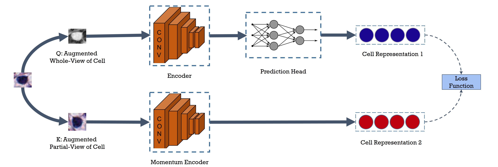

# CCRL: Contrastive Cell Representation Learning
_Accepted to ECCV 2022 (Workshop)_ 

Links: [[Arxiv](https://arxiv.org/pdf/2208.06445.pdf)][[Oral](https://youtu.be/gOv6ukYzLEw)]

## Summary
This repository is an implementation of the `CCRL: Contrastive Cell Representation Learning` paper. In this work, we adopted a novel self-supervised model to learn cell representations from Histopathology images (H&E). We evaluated the quality of these representations in cell cluster task, in which our model could significantly outperform all the baseline models significantly. Hopefully, this approach can enable our access to an unlimited amount of unlabeled data to perform higher-level tasks more efficiently. 

## Datasets
We mainly evaluated the performance of the model on two public datasets:
* [CoNSeP](https://warwick.ac.uk/fac/cross_fac/tia/data/hovernet/)
* [NuCLS](https://sites.google.com/view/nucls/home)

## Notes
* The code will be published after that the paper is published in IEEE/CVF. 

